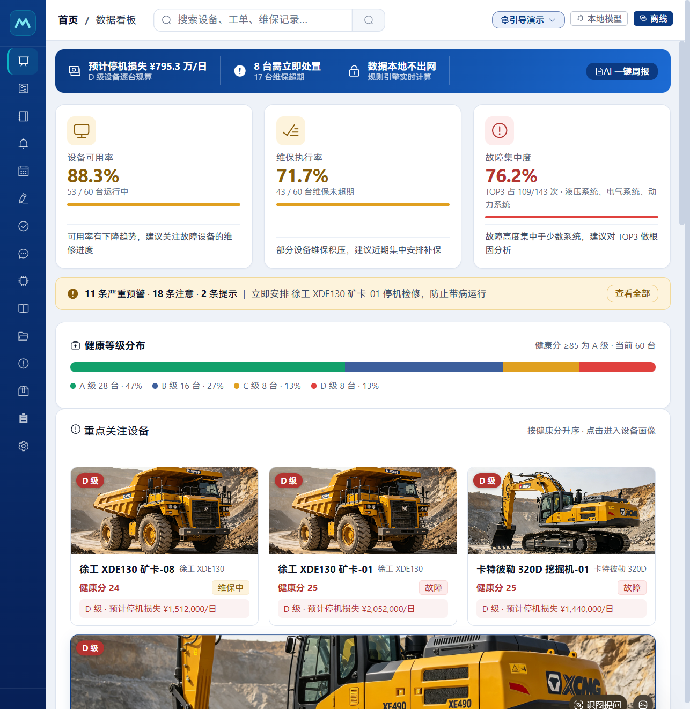
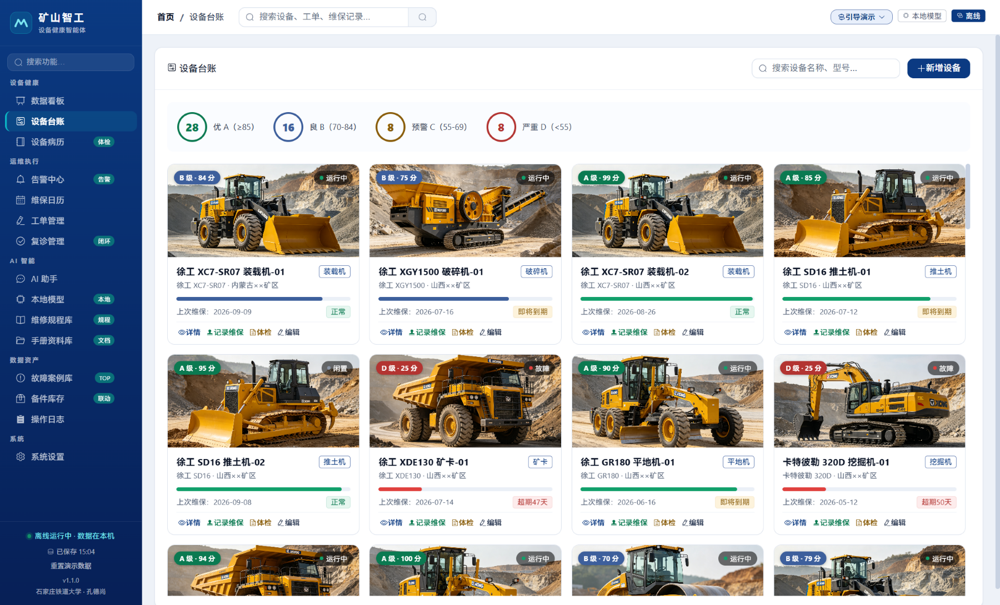
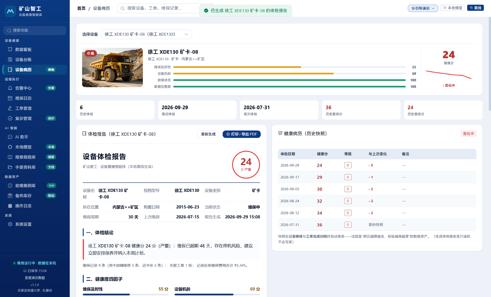
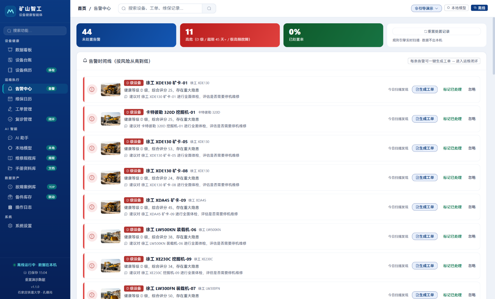
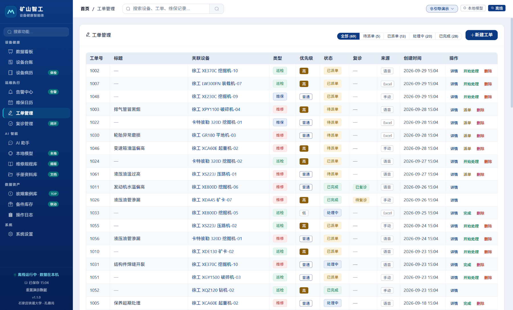
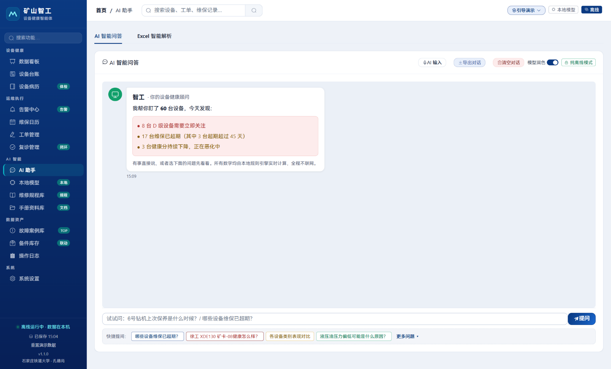
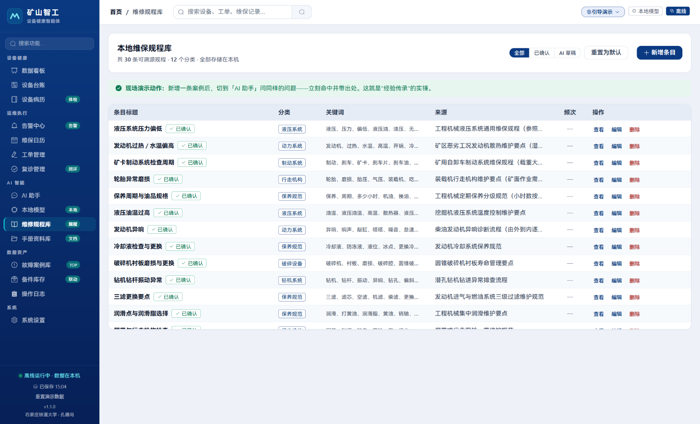
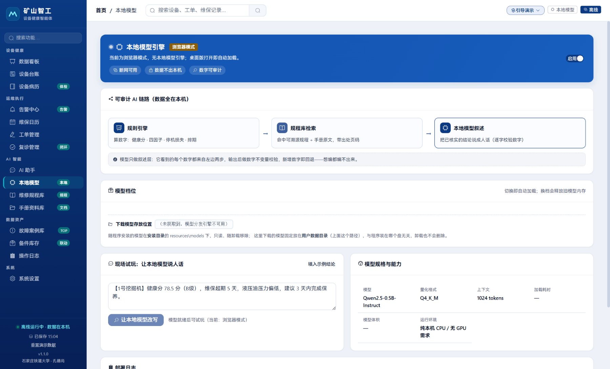
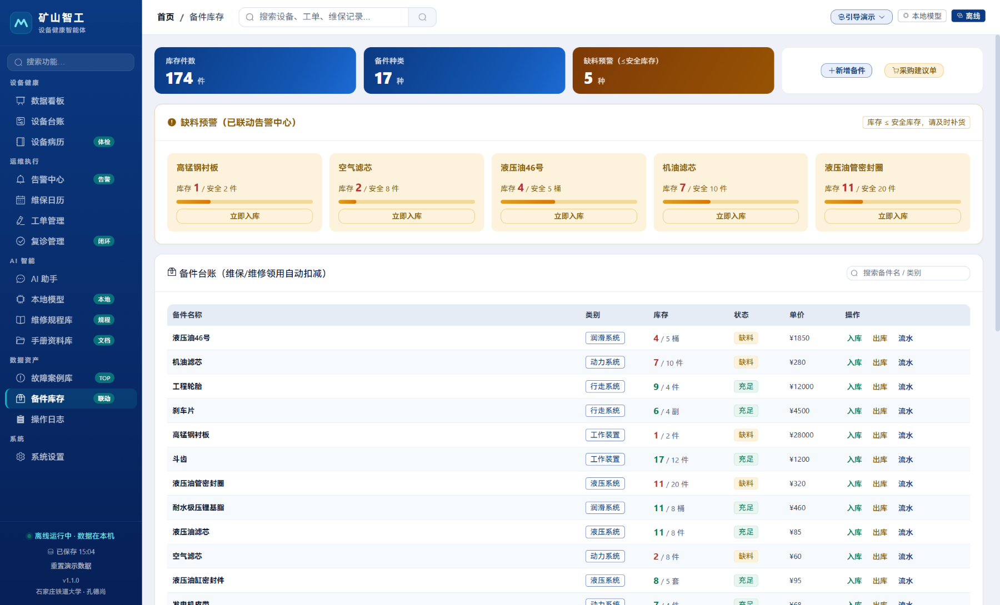
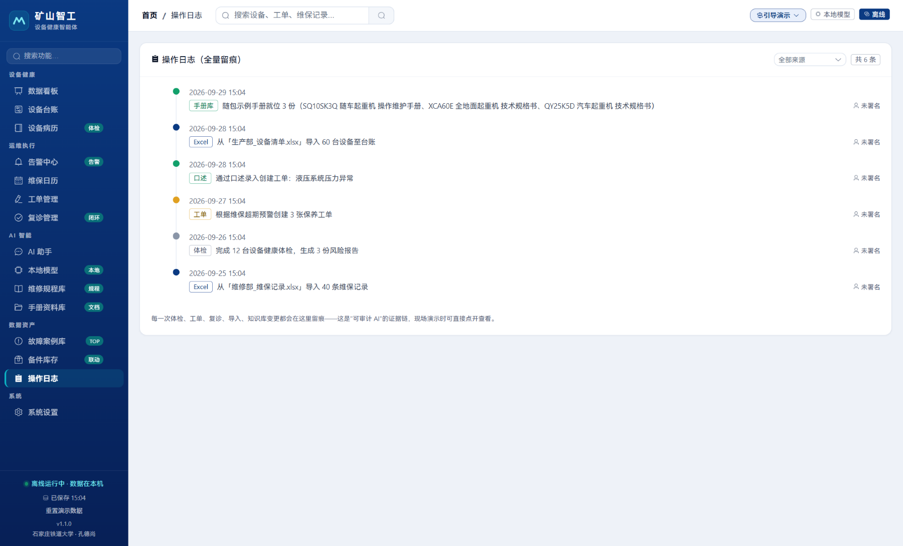

<p align="center">
  
</p>

# 矿山智工 · 设备健康智能体

面向矿山工程机械运维的**全离线**设备全生命周期工作台。

> 一台笔记本、**不联网、不调用任何云端大模型 API**，完成从台账导入 → 健康评分 → 告警 → 工单 → 复诊闭环 → 备件扣减 → 经验沉淀的全流程，且**每一个数字都能追溯到它的来源**。

<p align="center">
  <b>规则引擎算数字 · 本地模型说人话 · 全程离线可审计</b>
</p>

> 开发者：石家庄铁道大学 · 孔德尚　｜　版权所有 © 2026，保留所有权利（[LICENSE](LICENSE)）

---

## 界面预览

<p align="center">
  
  <br/><sub>数据看板 —— 停机损失、可用率、健康等级分布、重点关注设备一屏总览</sub>
</p>

| 核心页面 | 说明 |
|----------|------|
|  | **设备台账** · A/B/C/D 分级 · 卡片式设备画像 · 运行/维保状态一目了然 |
|  | **设备病历** · 四因子体检报告 + 健康快照历史，每个算式可溯源 |
|  | **告警中心** · 规则引擎实时扫描 · 高危告警一键生成工单 |
|  | **工单管理** · 巡检/维保/维修全状态流转 · 完成自动触发 7 天后复诊 |
|  | **AI 助手** · 统一输入框自动分流查询/写入 · 口述建单理解卡确认 |
|  | **维修规程库** · 30 条可溯源规程 · 12 分类 · 检索打分排序 |
|  | **本地模型** · 可审计 AI 链路 · 模型档位本机管理 · 断网可用 |
|  | **备件库存** · 缺料预警联动告警 · 维保领用自动扣减 |
|  | **操作日志** · 全量留痕 · 可审计 AI 的证据链 |

---

## 快速开始

```bash
npm install

npm run dev          # 浏览器开发模式（http://localhost:5173）
npm run electron:dev # Electron 桌面模式（含本地大模型）

npm run verify       # 一键验收：lint + 自检 + 覆盖矩阵 + 构建 + 两套端到端
```

首次启动自动播种一套**确定性**演示数据（固定随机种子 `20260912`）：60 台设备、69 张工单、352 条维修记录（另有 290 条健康快照、18 张故障案例卡）。规模与分布每次重置都一样 —— 演示不会"这次和上次不一样"；只有**日期是按"相对今天"生成的**，所以跨天重置后日期串会变。

---

## 为什么值得看

### 1. 数字不编造：规则引擎算，大模型只说人话

这是本项目的核心设计取舍。

现场数据不能出本机，所以**没有任何云端 AI**。但小参数模型（本地内置 Qwen2.5-0.5B-Instruct，Q4_K_M 量化，468 MB）直接做数值推理并不可靠 —— 它会自信地编出一个看起来很像的停机损失。

所以系统把职责切开：

```
规则引擎（确定性计算，出所有数字）
        ↓  只把已核实的结论交出去
    本地模型（只做叙述润色，不参与任何计算）
        ↓  出口处两道校验：数字不变量 + 形状
   生成文本里的每个数字必须 ⊆ 规则引擎给出的数字集合，
   而且这段话必须真的在复述结论（不是反问 / 复读提示词）
```

- 出口校验（内容）：`verifyNumbersSubset()`（`src/renderer/src/utils/llmClient.js`）
- 出口校验（形状）：`verifyNarrationShape()`（同文件）—— 0.5B 偶尔会**数字全对但整段答非所问**，数字校验结构上拦不住这一类，所以两条判据分开写、都拦
- 提示词硬约束写在引擎层，不在界面层：`SYSTEM_PROMPT`（`src/main/llmEngine.js`）
- 任何一环失败 → 回退到规则引擎的原始结论并在界面上如实说明原因，绝不把可疑输出放给用户
- 装机自检 `runSelfVerify()`：加载 + 生成 + 校验数字不变量，结果落盘 `userData/llm-verify.json`

也就是说：**大模型的失败模式是"少说"，不是"说错"**。

### 2. 每个结论都可审计：健康分拆到因子级

健康分不是一颗黑盒分数，而是四个可解释因子相加（`src/renderer/src/utils/health.js`）：

| 因子 | 规则 | 上限 |
|------|------|------|
| 维保及时性 | 每超期 1 天扣 2 分；无维保记录扣 30 分 | 扣分 ≤ 45 |
| 设备机龄 | 超过 5 年后每多 1 年扣 5 分 | 扣分 ≤ 45 |
| 故障状态 | 当前处于故障状态扣 30 分 | — |
| 数据完整度 | 购置日期/上次维保/设备型号每缺一项扣 5 分 | — |

分档 A(≥85) / B(70–84) / C(55–69) / D(<55)，并有**强制升级**：超期 > 30 天至少 C 级、> 45 天至少 D 级、故障状态直接 D 级 —— 不允许"分数好看"盖过现场事实。

每个因子都会同时输出 `{ 扣分, 计算式, 数据来源 }`，界面上、导出的体检报告里都能看到完整算式，例如：

> 距上次维保 140 天 − 周期 90 天 = 超期 50 天，每超期 1 天扣 2 分 → 扣 100 分，单因子上限 45 分，实际扣 45 分

停机损失同样是公开公式：

```
预计损失 = 风险系数 × 日产出假设 × 预估停时
预估停时 = min(20, max(3, round(超期天数 × 0.3)) + (故障 ? 5 : 0))   天
```

日产出按机型取值（矿卡 12 万/日、破碎机 9 万/日、挖掘机 8 万/日……），风险系数按等级取值、超期 30 天以上再 +0.2，最后夹在 [0.1, 0.9]。全部常量与算式在界面上可查、可按矿种切换预设场景（露天铁矿 1.6 / 砂石骨料 1.0 / 基建施工 0.55）。

### 3. 闭环是真的闭上的

```
Excel 台账导入 ──→ 健康评分 ──→ 告警扫描 ──→ 工单 ──→ 完成并归档
                      ↑                                    │
                      └────── 7 天后复诊 ←──────────────────┘
                                   │
                              复诊仍异常 → 再开工单
```

- **工单完成**会自动写入设备病历、生成 7 天后的复诊任务
- **维保记录里填了配件**会真的扣减备件库存，并在备件流水里留痕
- **同设备同系统故障 ≥ 3 次**会自动提炼成知识库草稿（`ai_draft`），积累成"经验传承"
- 现场录一条规程 → AI 助手**立刻**能检索到并作答

### 4. 离线不是口号，是可以验证的

- **运行期的对外网络请求只有一类：模型分发**。打开「本地模型」页或首次向导时会拉一次远端清单（`raw.githubusercontent.com` 上的 `models.json`，拉不到就用本地缓存/内置清单兜底），下载模型字节必须用户点击。除此之外 `src/` 内没有对外请求，也没有任何 API key
- **模型存两处，且与程序装在哪块盘无关**：随包内置的档位在安装目录的 `resources/models`（只读，随卸载一起移除）；用户点选下载的档位固定放在**用户数据目录**（Windows 为 `%APPDATA%\kuangshan-zhigong\models\`），「本地模型」页会把这条路径写出来并提供「打开目录」。删除只作用于下载副本：删**正在使用**的档位会先释放模型会话再删文件、删完自动切到另一个已安装档位；随包只读的档位没有下载副本，因此不提供删除入口
- Electron：`contextIsolation: true` / `nodeIntegration: false` / `sandbox: true`，preload 只通过 `contextBridge` 暴露白名单方法，不透传 `ipcRenderer`；每个 `ipcMain.handle` 都做调用来源校验
- 外部链接交给系统浏览器打开，且**只放行 http/https/mailto**；打印用的空白子窗口单独放行
- 数据库是纯 JS 的 SQLite（sql.js），Electron 下落盘为 `userData/kuangshan-zhigong.db`（先写临时文件再改名），浏览器下走 IndexedDB，再降级到 localStorage。**落盘失败会抛错并显示"保存失败"，且保持脏状态以便重试**
- 随包的 3 份示例手册是仓库内的本地文件（`src/renderer/public/manuals/`），不联网取；装完后由主进程复制进 `userData/documents/`，该目录之外的文件一律拒绝打开与删除
- 一键导出/导入 `.mbak` 备份（整库字节 + 对话历史 + 文档 + 设置，SHA-256 校验完整性）

---

## 功能一览

侧边栏 5 个分组、15 个入口：

| 分组 | 页面 |
|------|------|
| 设备健康 | 数据看板、设备台账、设备病历 |
| 运维执行 | 告警中心、维保日历、工单管理、复诊管理 |
| AI 智能 | AI 助手、本地模型、维修规程库、手册资料库 |
| 数据资产 | 故障案例库、备件库存、操作日志 |
| 系统 | 系统设置 |

几个值得一提的：

- **AI 助手**：统一输入框，自动分流到 *查询*（查台账/知识库）或 *写入*（口述建单）。写入类必须先在"理解卡"里确认才落库。
- **口述录入**：支持 7 类意图（报故障建单 / 完成工单 / 记录维保 / 改设备状态 / 完成复诊 / 写知识库 / 查询）；句子带疑问词判为提问而非报修；设备指代有 6 层匹配（全名 → 口述别名 → 型号+序号 → 类别+序号 → 纯型号/纯类别 → 模糊打分），执行前有预检、执行后可一键撤销。
- **维修规程库**：内置 30 条规程（其中 14 条标注徐工机型），12 个系统分类，34 组同义词，检索按打分排序 —— 问"挖机水温高"也能命中《发动机过热 / 水温偏高》。
- **备件库存**：与维保记录用的是同一份件名目录，所以"记录里写了换件"和"库存里扣了件"不会各说各话。
- **手册资料库**：装完就有 3 份真手册（SQ10SK3Q 随车吊 36 页 / XCA60E 全地面吊 32 页 / QY25K5D 汽车吊 18 页，共 4.72 MiB），带逐页文字层，可直接向 AI 提问，回答注明《手册名》第 N 页。
- **操作日志**：写入留痕并落库，刷新不丢（保留最近 500 条），**每条记着操作人** —— 这是"可审计 AI"的证据链。
- **体检报告**：含四因子算式与数字溯源，可一键打印（浏览器打印对话框里选"Microsoft Print to PDF"即可存 PDF）。
- **引导演示**：右上角一键播放的 12 步主线，跨路由带遮罩高亮与进度，可前进/后退/随时退出，默认手动推进。
- **应用锁与身份**：为本机配一个或多个账户（姓名 + 4~6 位数字 PIN，PBKDF2-SHA256 + 随机盐，**不存明文**）；启动先出锁屏、解锁才装载业务数据；空闲自动锁默认 10 分钟；解锁后每条操作日志都记下操作人，侧边栏常显"当前是谁在操作"。它是**界面锁，不是文件加密**。

---

## 技术栈

| 层 | 选型 |
|----|------|
| 前端 | Vue 3 + Element Plus + Pinia + Vue Router |
| 样式 | CSS 自定义属性令牌层（`styles/tokens.css`）+ Element Plus 主题变量覆盖 |
| 图表 | ECharts（`components/TrendChart.vue`，按需注册模块 + 异步加载） |
| 动效 | GSAP（仅用于数字滚动等必要交互）+ CSS 过渡（入场编排） |
| 引导 | driver.js（右上角「引导演示」，按需加载） |
| 构建 | Vite |
| 桌面 | Electron（contextIsolation + nodeIntegration:false + sandbox，原生能力只经 preload 白名单） |
| 数据库 | sql.js（纯 JS SQLite，零部署单文件） |
| Excel | SheetJS（前端直接解析，多文件合并） |
| 本地推理 | node-llama-cpp + Qwen2.5-0.5B-Instruct Q4_K_M |
| PDF | pdfjs-dist（按需动态加载） |

> 三个新增的前端库（ECharts / GSAP / driver.js）都验证过是**纯 JS、零 `.node`、零 `.wasm`、样式表内无远程 URL**，且都由 `import()` 按需加载、各自独立成 chunk —— 首屏不为它们付一次下载。离线铁律没有因此松动。

---

## 验收

下列验收命令，**全部可一条命令跑通**（不需要事先手工开终端起服务器）：

```bash
npm run lint         # 静态检查（只拦真错，不管风格）
npm run self-check   # 纯逻辑断言（含落盘失败/播种判据/库损坏的故障注入）
npm run main-check   # 主进程契约（IPC 参数形状、来源校验、档位切换、模型删除与释放顺序、清单兜底）
npm run store-check  # store 行为（Node 下真正装配 pinia + sql.js 跑 appStore/persistence）
npm run pack-check   # 打包依赖闭包（运行时依赖会不会被 files 规则排掉、原生库解包没解包）
npm run coverage     # 口述指代消解的功能覆盖矩阵
npm run e2e          # 无头浏览器端到端（真实点击真实路由）
npm run e2e:nl       # 口述录入端到端（含撤销、歧义、不误写）
npm run audit:contrast  # 15 条路由的文字配色对比度（WCAG AA，浅色令牌）
npm run audit:contrast:dark  # 同一条门禁的深色版（**不在 verify 链里**）

npm run verify       # 上面除深色那条外的 9 条 + 生产构建，共 10 步
```

> 断言的**条数以脚本实际输出为准**，本文不写死数字。要看当前值直接跑脚本，末行会打印"合计 N 项"。

### 单机规模压测 `npm run bench:scale`

回答"5000 台设备、5 万条维保记录时它还转得动吗"。**不进 `verify` 门禁**：

```bash
npm run bench:scale                                            # 默认 5000 台 / 5 万条 / 8 本手册 × 300 片
npm run bench:scale -- --devices=20000 --records=200000 --repeat=3
```

本机实跑（2026-09-27，Windows 11 / Node 24.16）—— 数字会随机器抖动，**看量级不看小数**：

| 场景 | 中位 |
|------|------|
| 首启（空库 → 播种 60 台） | 8 ms |
| **满库首启**（读回 5000 台 + 5 万条） | **246 ms** |
| **看板重算**（健康分 + 分档 + 超期 + 预警） | **56 ms** |
| **检索一次提问** | **22 ms** |
| 一次真实用户写入（含整库重写 + 序列化） | **108 ms** |
| 批量灌数·维保记录 | **0.24 ms/条** |

---

## 已知边界（不粉饰）

以下是**当前版本确实没做**的，写在这里以免误解：

- **应用锁锁的是「界面」，不是「文件」**：`userData/*.db` 仍可被任何 SQLite 工具直接打开；角色只做标识、不做权限拦截。它是防"旁人随手翻看 / 误操作"的锁，不是防技术人员的锁。
- **语音识别未实现**，拍照 OCR 为演示用的模拟结果（真实版本可替换为 Tesseract.js 本地识别），界面上打着「演示样例」角标。
- **撤销的覆盖面有限**：只有口述录入 / AI 助手可撤销；工单完成、复诊、备件出入库、设备增改、Excel 导入、备份导入都没有撤销。
- **操作日志是滑动窗口，不是全量**：内存与落库各保留最近 500 条，且备件出入库、设备新增/编辑、复诊标记这几类写入没记日志。
- **本地模型的显存/内存需求没有给出实测数值**，只有"纯 CPU 推理、无需 GPU"的定性结论。
- 演示数据是程序生成的，非真实矿山数据；矿区名称使用"云南××矿区"这类脱敏写法。
- **备份的 SHA-256 只防损坏，不防篡改**；**没有定时自动备份**（只有导入备份前自动备份一次）。
- **随包手册只有 3 份**（起重/随车吊）；主力机型挖掘机的完整手册不是中文，未随包 —— 内容已提炼进维保项目库与故障现象库。
- **离线安装包需要自备模型**：`resources/models/` 被 `.gitignore` 忽略（468 MB 不进版本库），干净克隆要构建离线包得自己放进去；只跑"在线轨"（模型由用户点选下载）则不受影响。

---

## 目录结构

```
src/
  main/          Electron 主进程（窗口、IPC、LLM 引擎）
  preload/       contextBridge 白名单
  renderer/
    public/manuals/  随包示例手册（3 份 PDF 原件 + 逐页文字层 JSON，共 4.72 MiB）
    src/
      views/       15 个业务页面（共 15 个 .vue）
      components/  复用组件（全局搜索、聊天消息、导入面板、ECharts 趋势图、数字滚动…）
      stores/      Pinia（appStore 主状态 + nlActions 口述动作/撤销）
      styles/      设计令牌与 Element Plus 主题（tokens.css / driverTheme.css）
      utils/       健康评分、知识库、口述解析、数据库、Excel、备份、动效、引导路线…
scripts/         验收脚本 + build-manual-assets.mjs（随包手册生成）+ bench-scale.mjs（规模压测）
docs/            界面截图（screenshots/）
resources/models/ 本地模型（468.6 MiB，约 491 MB；不随仓库分发）
```

---

## 许可

**专有许可 · 保留所有权利。** 版权所有 © 2026 石家庄铁道大学 孔德尚。

未经著作权人事先书面许可，不得复制、修改、分发本作品或其任何部分，亦不得用于商业目的。
全文见仓库根目录 [`LICENSE`](LICENSE)。

随包的工程机械手册等资料来源于公开渠道，其著作权归原权利人所有，此处仅作技术演示之用。
